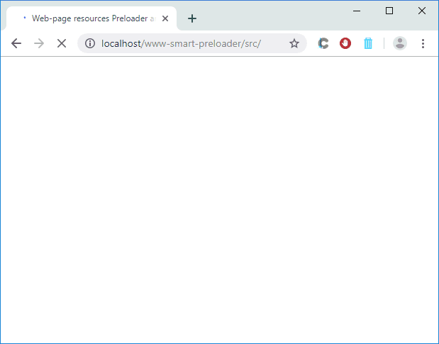
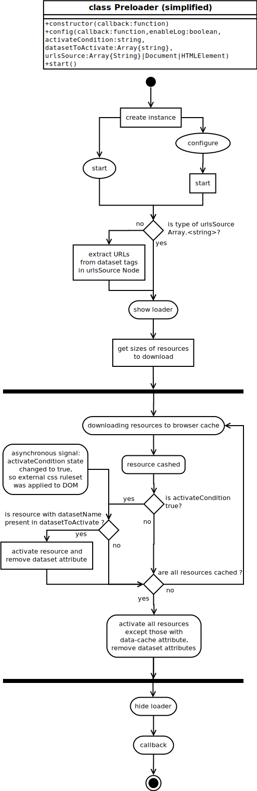

# www-smart-preloader
Web-smart-preloader is a pure Javascript class that smoothing out the negative effect on the visitor during long page loading. It caches links inside a web page, displays a detailed loader, activates resources during and after downloading, and trigger callback.




## Overview
Web-smart-preloader is a pure Javascript class with a little php help. Its goal is smoothing out the negative effect on the visitor during long page loading. It pre-loads (caches) resources inside a web page, displays the loader as download bar with detailed information about downloading process: %, speed, overall downloaded/target size, file download with downloaded/target size etc. It can activate cached resources during and after downloading, and trigger callback at the end.

## Table of contents
- [Overview](#Overview)
- [Description](#Description)
  - [The problem](#The-problem)
  - [Goals](#Goals)
  - [Tasks](#Tasks)
  - [Solutions](#Solutions)
- [Features](#Features)
- [Dependencies](#Dependencies)
- [Requirements](#Requirements)
- [Installation](#Installation)
- [Usage](#Usage)
- [Usage restrictions](#Usage-restrictions)
- [Configure](#Configure)
- [Tutorials](#Tutorials)
- [Examples](#Examples)
- [Activity diagram](#Activity-diagram)
- [Demo](#Demo)
- [TODO](#TODO)
- [Contributing](#Contributing)
- [Communication](#Communication)
- [Credits](#Credits)
- [License](#License)

## Description
### The problem
Website developers are increasingly using loaders to take the visitor’s attention for a short time before the main content appears. But this may not be enough in case of a long wait. The visitor may have questions “what's happening?”, “how much longer to wait?”. He may not have the patience to wait for the page to load, negative emotions or a negative impression about the site may appear.

### Goals
Smooth out the negative effect on the visitor during long loading. Answer to visitors' questions. Create a sense of control over what is happening.

### Tasks
- show additional or preview information during the page loading, to attract the attention of the visitor.
- inform the visitor about the loading process so that he can approximately determine the waiting time and what is happening right now.

### Solutions
- cache and activate resources while page loading process. Resources URLs are extracted from the entire document or within the specified node (HTMLElement). As input alternative, use an array of links, in this case only caching occur for future outside activation
- display the loader as download bar with detailed information about downloading process: %, speed, overall downloaded/target size, file download with downloaded/target size etc.

## Features
- caching resources retrieved from URLs array or web page by specified dataset attributes in tags
- activating all resources after caching  
- activating specified resources in tag after external CSS ruleset loaded and applied to DOM
- displaying loader as download bar while downloading resource with the appearance and disappearance
- loader info:
  - downloading percentage
  - average download speed
  - downloaded / total bytes of all resources
  - current file with downloaded / total bytes
  - user-friendly errors

## Dependencies
None. The code is written in vanilla JavaScript and vanilla PHP

## Requirements
- server-side: PHP >= 5.2.0
- client-side: support ECMAScript 2018 (without babel and polyfills)

## Installation
1. Copy the file `getFilesSize.php` to the site root folder (the path to the script can be changed in the method `_getFilesSize`). It is php script that receives files links array and returns their  sizes array
2. Copy the file `Preloader.js` to the site root folder
3. [optional] Copy the template file `index.html` from demo folder

## Usage
1. Add to index file tag`<script src='Preloader.js'></script>`
2. Add to index file tags that has resources to be caching (they can be anywhere)
3. Specifying dataset attributes in tags at clause 2.
   - to specify URL to cache, use the dataset attribute: `data-cache=URL`.
   - to specify URL to be activated after caching, rename the URL-containing attribute to its corresponding dataset attribute:
     - `src=URL` > `data-src=URL`, for example: `` > `` or `<script src=URL>` > `<script data-src=URL>`
     - `href=URL` > `data-href=URL`, for example: `<link href=URL rel='stylesheet'>` > `<link data-href=URL rel='stylesheet'>`
     - `style="background-image: url('URL')"` > `data-style-background-image=URL`   
4. Change attributes in clause 2: `src=URL` > `data-src=URL`, `href=URL` > `data-href=URL`, `style='background-image: url("URL")'` > `data-style-background-image=URL`
5. Create instance of class `Preloader` without parameters or with [optional] parameter  `callback` (type `function`).
6. [optional] Configure Preloader instance by method `config`. See [Configure section](#Configure)
7. Start with method `start` after `DOMContentLoaded` or `load` events, or at any time after the above.

Resource activation is automatic by creating attributes from dataset:
1. `data-src=URL` > `src=URL`
2. `data-href=URL` > `href=URL`
3. `data-style-background-image=URL` > `htmlElement.style.backgroundImage = url('URL')`

Dataset attributes will be deleted after resources caching and activation. Due to this, for example, a smooth appearance of element can be implemented by CSS animation:
```css
.background[data-src] {
     opacity: 0;
     }

.background:not([data-src]) {
     opacity: 1;
     transition: opacity 2s;
     }
```
Explanation: initially, element with class `background` and attribute `data-src` has zero opacity, after automatically deleting attribute `data-src`, element opacity will be 1, so CSS opacity animation will start from 0 to 1 for 2 seconds
 
 ## Usage restrictions
- `Preloader` use DOM, don't run method `start` before `DOMContentLoaded` event.
- Tags with dataset attributes should not have the appropriate attributes `src`, `href` etc., otherwise caching will not make sense.
- Resources location is supported in accordance to the `same-origin` policy, CORS implementation is in [TODO-list](TODO.md).
- Enabling built-in speed limit in some browsers leads to re-downloading some cached resources (.js, .css), which may delay resource activation until total download complete.

## Configure
Full list of config parameters:
- `callback` callback function (type {Function})
- `enableLog` enable logging to console: true/false (type {boolean})
- `activateCondition` css detection: a false condition that becomes true when external CSS rules are loaded and applied to DOM (type {string}).
- `datasetToActivate` a string array with dataset's names in attributes of resources that must be activated after 
activateCondition becomes true (type string[]}). Example: ['data-src', 'data-href']
- `urlsSource` URL's sources: root node for URLs extraction or array with URL's strings, default - root node: document (type 
string[]|Document|HTMLElement). 

Set callback function to run after caching and activating is done:
- in constructor:
```javascript 
let preloader = new Preloader(callbackFunction);
```
- in config:
```javascript
preloader.config({
    callback: callbackFunction,
})
```

You can run Preloader without any parameters, so default values/actions will be applied:
- no actions after caching and applying without `callback`
- logging to console disabled without `enableLog: true`
- resources will be activated after downloading all files except tags containing dataset-attributes 'data-cache' without `activateCondition` or `datasetToActivate`
- getting URLs by extracting them from tags containing dataset-attributes 'data-...' in the entire document without `urlsSource`

`activateCondition` and `datasetToActivate` must be assigned to activate resources immediately after applying an external CSS ruleset, before the end of loading all resources.

For example, it may be necessary to apply the cached background picture of an element while the process of loading other resources is still ongoing, but the external css class and preparation for CSS animation must be applied to the element before its background picture is displayed.

## Tutorials
1 . Minified start without any parameters (caching and activating resources extracted from entire document, display loader as download bar) :
```javascript
window.onload = () => (new Preloader()).start();
```
2 . The same as clause 1 but callback assigned in constructor.
```javascript
window.onload = () => {
     (new Preloader(() => {alert('Preloader ended successfully')}))
     .start()
};
```
3 . The same as clause 1 but callback assigned in config.
```javascript
let preloader = new Preloader();
preloader.config({
     callback: () => alert('Preloader ended successfully')});
window.onload = () => preloader.start();
```
4 . Full config. Caching and activating resources extracted from element with '.gallery' selector, assign callback, activating background images immediately after external CSS rules applied to DOM (external css contain: `body { color:red }` ). See [Examples](#Examples) for activateCondition.
```javascript
let preloader = new Preloader();
preloader.config({
     activateCondition: 'getComputedStyle(document.body).color === "red"',
     datasetToActivate: [
         'data-style-background-image',
         'data-src' ],
     enableLog: true,
     urlsSource: 'document.querySelector(".gallery")',
     callback: () => alert('Preloader ended successfully')});
window.onload = () => preloader.start();
```
## Examples
examples for `activateCondition` parameter based on external css rules `./css/media.css` with following contents:
```css
.myClass {
   color: blue;
   height: 10vh;
}
```
```javascript
// if element's color didn't assign before external css rule applied
condition = 'getComputedStyle(document.querySelector(".myClass")).color';
condition = 'getComputedStyle(document.querySelector(".myClass")).color == "blue"';
// if element's height didn't assign before external css rule applied
condition = 'document.querySelector(".myClass").offsetHeight';
condition = 'document.querySelector(".myClass").offsetHeight > 0';
condition = 'parseInt(getComputedStyle(document.querySelector(".myClass")).height)';
// wrong example, it is necessary to check the computed style applied to the element
// by getComputedStyle, not the immediate style of the element itself
condition = 'document.querySelector(".myClass").style.color';
// wrong example, it is necessary to check the computed style applied to the element
// by getComputedStyle or offsetHeight, not the immediate style of the element itself
condition = 'document.querySelector(".myClass").style.height > 0';
// wrong example, the condition value will be '0px' at the beginning,
// and casting it to boolean will yield true, so you need to do a string comparison
// === '0px' or convert to the number by parseInt
condition = 'getComputedStyle(document.querySelector(".myClass")).height';
```
Console messages with `preloader.config({ enableLog: true });`
```
270 Preloader: get NodeList                                                    |Preloader.js:769 
271 Preloader: get download links                                              |Preloader.js:769 
272 Preloader: get files size                                                  |Preloader.js:769 
333 Preloader: check files size                                                |Preloader.js:769 
333 Preloader: downloading 1 of 5 links: resources/media.css                   |Preloader.js:769 
334 Preloader: downloading 2 of 5 links: resources/dummy.js                    |Preloader.js:769 
334 Preloader: downloading 3 of 5 links: resources/background-tiny.jpg         |Preloader.js:769 
335 Preloader: downloading 4 of 5 links: resources/big_size_font.woff          |Preloader.js:769 
335 Preloader: downloading 5 of 5 links: resources/big_size_background.jpg     |Preloader.js:769 
450 Preloader: resources/media.css caching complete                            |Preloader.js:769 
450 Preloader: activate external CSS rules in resources/media.css              |Preloader.js:769 
463 Preloader: resources/dummy.js caching complete                             |Preloader.js:769 
465 Preloader: external CSS rules in 'resources/media.css' were applied to DOM |Preloader.js:769 
520 Preloader: resources/background-tiny.jpg caching complete                  |Preloader.js:769 
521 Preloader: background 'resources/background-tiny.jpg' activated            |Preloader.js:769 
5882 Preloader: resources/big_size_background.jpg caching complete             |Preloader.js:769 
6394 Preloader: resources/big_size_font.woff caching complete                  |Preloader.js:769 
6394 Preloader: download to cache complete: total 11015 KB in 5 files          |Preloader.js:769 
6395 Preloader: resource 'resources/dummy.js' activated                        |Preloader.js:769 
6396 Preloader: caching & activating resources complete                        |Preloader.js:769 
6399 I am JavaScript code from resources/dummy.js: i was cached and activated  |dummy.js:1       
7397 Callback function completed successfully                                  |(index):26       
```

## Activity diagram


## Demo
The demo is in [its folder](/demo). View it [there](https://root.com.ua/portfolio/projects/www-smart-preloader). It implements resource loading with quick display of low-quality image while loader show process of downloading other resources. When everything downloaded, cached resources are activated, including a Hi-Res image, which replaces its low-quality counterpart.
Also, there are comments explaining how to start minified Preloader.
Attention, for greater clarity, the size of downloaded resources is made at 5 MB

## TODO
[TODO list](TODO.md)

## Contributing
Thanks for taking the time to start contributing!

I'd love to accept your suggestions and patches to make this project better and more useful.

As a potential contributor, your changes and ideas are welcome at any hour of the day or night, weekdays, weekends, and holidays. Please do not ever hesitate to ask a question or send a pull request.
If you have any questions or suggestions or any problem with this project, please [file an issue](https://github.com/Nickieros/www-smart-preloader/issues).

This project accepts contribution via github [pull requests](https://help.github.com/articles/about-pull-requests/). This document outlines the process to help get your contribution accepted.

Please remember to read and observe the [Code of Conduct](https://github.com/cncf/foundation/blob/master/code-of-conduct.md).

## Communication
If you have any questions or suggestions for this project, please [file an issue](https://github.com/Nickieros/www-smart-preloader/issues). For other questions [contact me](https://github.com/Nickieros).

## Credits
2019 [Nickieros](https://github.com/Nickieros)

## License
MIT
